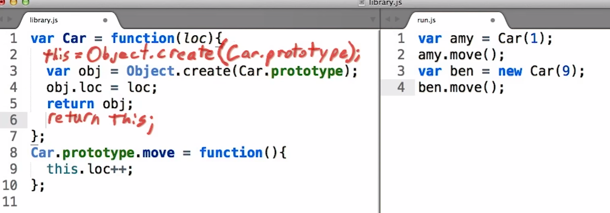

# this and new

## new

ở function constructor ta thấy việc tạo ra 1 đối tượng luôn phải làm 3 việc

1. tạo ra 1 biến obj\(sẽ làm closure\) refer tới một đối tượng chưa các phương thức
2. gán các thuộc tính cho obj
3. trả về obj 

\(1\) và \(3\) luôn luôn được được lập lại hoàn toàn giống nhau nên ngôn ngữ đã hỗ trợ một cách làm tự động hiểu quả hơn là dùng từ khóa **new**



```text
var Car = function (loc) {
    // this = Object.create(Car.prototype)
    this.loc
    // return this
}

Car.prototype = {
    move:  function() { /*  */ },
    brake: function() { /*  */ }
}
```

## this

ở đây chúng ta thấy rõ this đã được tạo mới và sẽ được trả về mỗi khi gọi new

```text
var THIS = function () {
    console.log(this);
}

new THIS() // > this = ???
THIS()     // > this = ???
```


